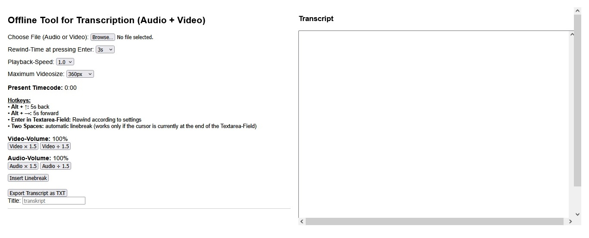
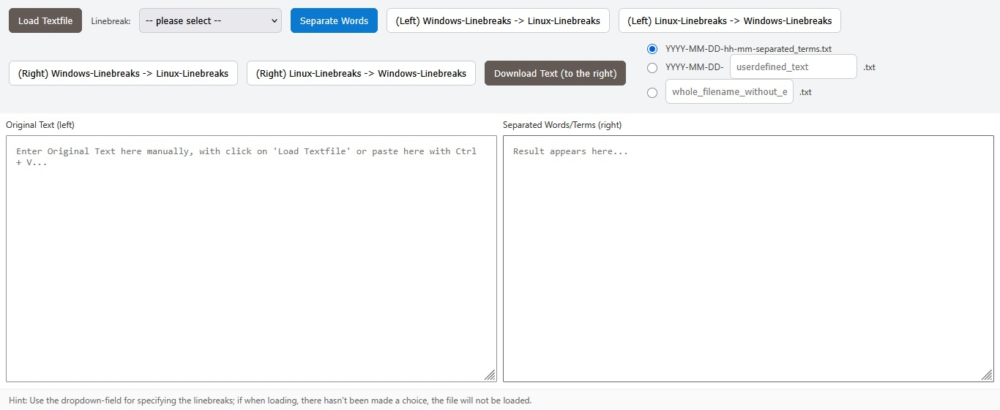
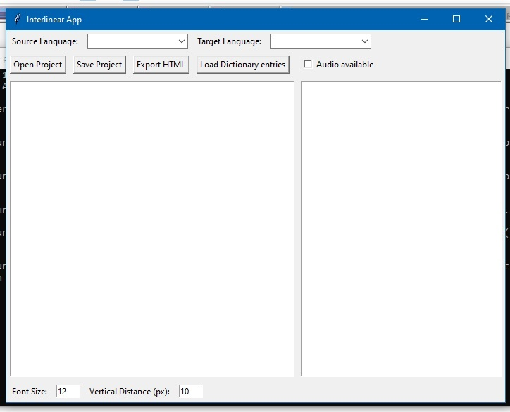
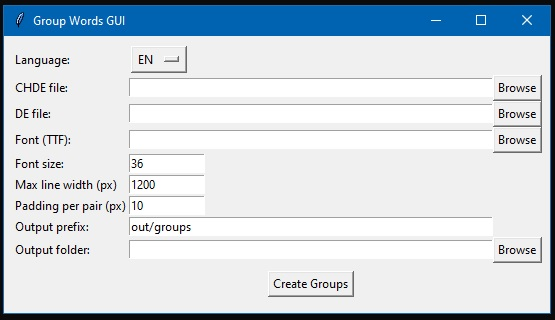
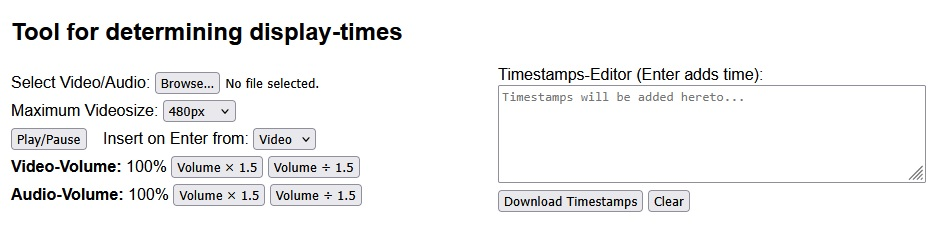

# Software requirements

**[NOTE: This document is only a draft yet]**

Overall goal:
- The overall goal of the 3 Software parts a, b and c is to create interlinear texts as well as burn interlinear subtitles onto a video, so that with the help of the texts or with the help of the subtitles someone who speaks language b is able to understand what is being said in language a in a certain audio-recording or video recording.
- All the software should work completely offline
- All the software should run on Windows 7 and Windows 10*

* At least in a first step. Maybe later on, functionality can be added to the software that allows it to be run on Linux, even though textfiles created on Linux might have different line-break characters than textfiles created on Windows.

## Part a) Creating interlinear texts (html-files)

See folders for step 1, step 2 and step 3

### Step 1

The software of step 1 is just a help to bring an audio- or video-recording into a written form. The software should just be an aid to manually transcribe the contents of the recording. Being able to manually transcribe a recording is maybe important for audio-tracks in Swissgerman because maybe there isn't currently any Voice-Recognition that can automatically transcribe Swissgerman into text-form. But even if there were, this software enables transcription of Swissgerman audio- or video-recordings without AI or without complex voice-recognition software by simply enabling someone to easily write what he hears.

### Step 2

The software of step 2 is used to separate each word of the text by a linebreak from the next word in the text.

I used this concept already in an older version of the software (see e.g. [here on github](https://github.com/p-freeman/InterlinearTextCreatorForTwoLanguages/blob/main/for_english_speakers/textsplitter_project_3_v2_(textsplitter_can_retain_paragraphs_now).py)) and basically the advantage of having one word per line is that when I then would copy that text over into Google Translate or deepl.com (though I don't remember if it works - or worked - for both or only for one of them) and then get a word-by-word translation (or mostly a word-by-word-translation) instead of a sentence-by-sentence-translation that I would get, if I were to copy a normal text over into Google Translate or deepl.com to have I translated.

### Step 3

The software in Step 3 is used to create the translation of the words of language a into language b, however, it's intended for a word-by-word-translation and not a sentence-by-sentence-translation.

It's important to me, that when a project is saved, that the software saves new translation of words to a dictionary file for the language-pair of the current project. Then, when another project gets opened or created for the same language pair (e.g. again the source-language a would be Swissgerman and the target-langauge again would be German/Highgerman), then the translation for the words that appeared in the first project should be able to get imported from a dictionary file of the current language pair into the textarea-field which contains the translations into German of the words in Swissgerman.

This way, the more the software gets used, the more the dictionary file for a language pair can grow and thus with each new project, less and less words have to be translated from scratch, because the most frequent words in the source-language step by step will already have an entry in the dictionary file and thus a standard-translation or a translation variant can already be pre-populated into the textarea field of the target-language on the line that corresponds to the correct line in the textarea-field for the source-language (Of course it's only true that less and less words have to be translated in a new project, if the new project doesn't contain a vast number of new words that don't already have an associated translation deposited in the dictionary file.

As of now, Swissgerman is not supported by Google Translate, but to my surprise some Swissgerman phrases that I tried got translated correctly into English by deepl.com (though I don't remember if all of the phrases I tried at deepl.com got translated correctly over there, I assume it was most of them).

Now one of the things I'd like to accomplish is to have a transcript in Swissgerman which then can be translated manually with the software in step 3 into German/High German (and thus a Swissgerman-German/High German interlinear text gets created) and which can then from German be translated into yet another language (e.g. thus a Swissgerman-English text can get created). That second translation step should also be possible with the same software.

## Part b) Putting interlinear subtitles onto videos

See folders for step 4, step 5 and step 6

### Step 4

### Step 5

### Step 6

## Part c) Managing the dictionary files

Somehow there should exist a way how the software to create the interlinear texts can create dictionary files with the new translations a certain project contains which the complete dictionary-file for a certain language pair doesn't yet contain.

See the following example folder structure:

interlinear_text_projects/
├── README.md
├── interlinear_texts/
│   ├── xy.??
│   ├── xy.??
│   └── xy.??
├── videos_with_interlinear_subtitles/
│   ├── input/
│   │   └── xy.??
│   └── output/
│       └── xy.??
├── dictionary_files/
│   ├── chde_de/
│   └── xy.??
└── docs/
    └── xy.??

